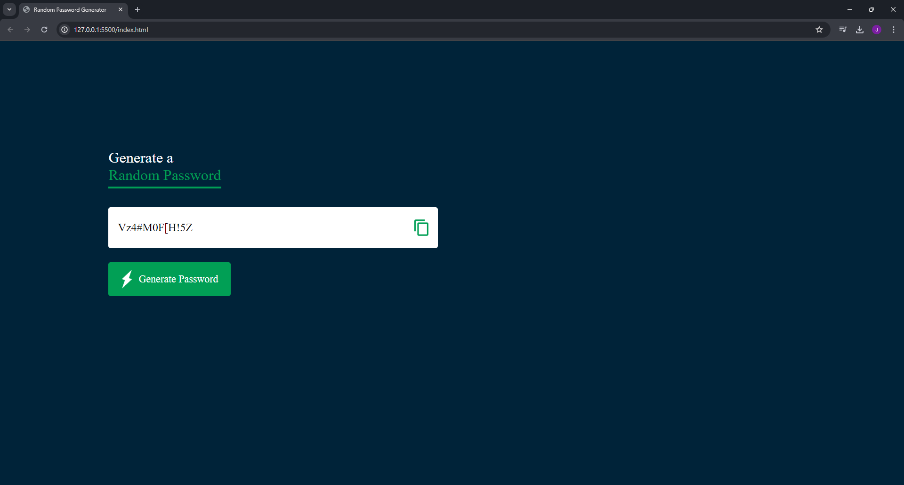

# Random Password Generator

A simple **Random Password Generator** built using **HTML, CSS, and JavaScript**. This app generates strong passwords with **uppercase, lowercase, numbers, and symbols**. It also includes a **copy-to-clipboard icon** to quickly copy the newly generated password.

## Features
- Generate strong random passwords  
- Includes uppercase, lowercase, numbers, and symbols  
- Copy password to clipboard with one click  
- Responsive and simple UI

## Technologies Used
- **HTML**  
- **CSS**  
- **JavaScript**

## How It Works
1. Click the **Generate Password** button.  
2. A random strong password will be created.  
4. Click the **copy icon** to copy the password to your clipboard.  
5. Paste it anywhere you need — safe and secure!

## Live Demo

[Click here to try it](https://jasnafathim.github.io/Random-Password-Generator/)

## Screenshot

- **Dashboard**

   
- **Random Password Generation**

## Other Links

LinkedIn: [LinkedIn](https://www.linkedin.com/in/jasnafathim)
Medium Article: [Create a Secure Random Password Generator with HTML, CSS & JavaScript](https://medium.com/@jasnafathim/create-a-secure-random-password-generator-with-html-css-javascript-689ea7eb0e32)
